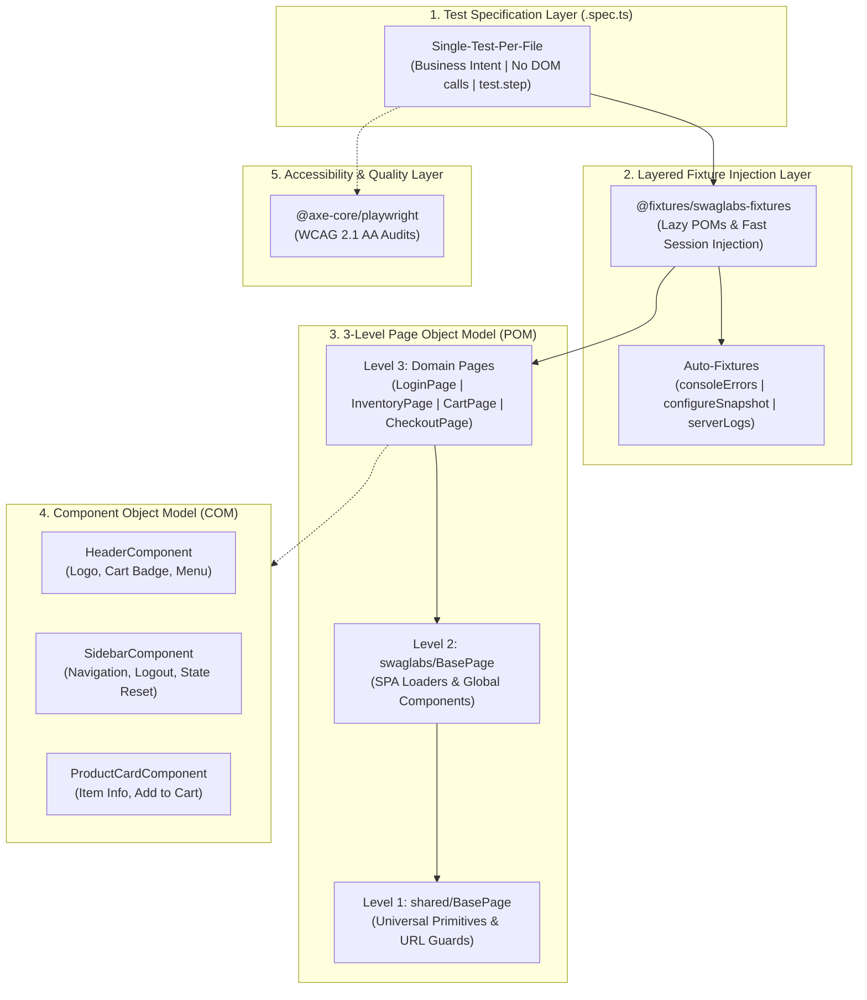

# Swag Labs E2E Automation Framework

[](https://github.com/Gramir/playwright-typescript-sdet-framework/actions/workflows/e2e.yml)
[](https://Gramir.github.io/playwright-typescript-sdet-framework/)
[](https://www.deque.com/axe/)
[](https://www.typescriptlang.org/)
[](https://playwright.dev/)
[](https://prettier.io)

An enterprise-grade End-to-End (E2E) test automation framework for [Swag Labs](https://www.saucedemo.com/) built with **Playwright**, **TypeScript**, and **Axe-Core**.

---

## 🎯 Framework Objectives

The primary goal of this framework is to provide a reliable, maintainable, and completely deterministic test suite that models real-world user flows on SauceDemo while enforcing strict SDET engineering standards:

- **Zero Flakiness**: Eliminates race conditions and timing issues without using arbitrary sleeps (`waitForTimeout`) or brittle selectors.
- **Linear Readability ("Ponytail Simplicity")**: Test specifications read like pure business scenarios with no low-level DOM manipulation, branching logic, or loops.
- **Full Parallel Determinism**: High-speed test execution across isolated operating system workers with zero shared state.
- **Automated Accessibility Compliance**: Integrated WCAG 2.1 AA accessibility auditing powered by Axe-Core.
- **Continuous Quality Gate**: Automated GitHub Actions CI/CD pipeline verifying code formatting, strict typing, and publishing live interactive HTML reports.

---

## 📐 Architecture Diagram



---

## 🏛️ Architectural Decisions: Why It Was Built This Way

### 1. Layered Fixture Injections

In conventional frameworks, tests import `test` and `expect` directly from `@playwright/test` and copy-paste setup hooks (`beforeEach`, `afterEach`).

In this architecture, tests import exclusively from `@fixtures/swaglabs-fixtures`:

- **Centralized Lifecycle Enforcement**: Automatically injects global test isolation, cookie resets, failure reporting, and browser error monitoring.
- **Elimination of Hook Duplication**: Setup and teardown contracts are maintained once inside fixture layers rather than scattered across test files.

### 2. Fast Authentication Strategies: StorageState & Direct Injection

Enterprise test suites should not repeat UI login sequences on hundreds of tests when authentication is not the feature under test. This framework demonstrates two high-performance authentication patterns:

- **Programmatic Session Injection (`authStrategy: 'fast_injection'`)**: Injects the authenticated session cookie (`session-username`) directly into the browser context and navigates straight to `/inventory.html`. Reduces test startup overhead to sub-second speeds.
- **Playwright `storageState` Persisted Sessions (`tests/setup/auth.setup.ts`)**: Pre-authenticates and captures complete browser storage to `.auth/user.json` for cross-test session reuse.
- **Full UI Form Authentication (`authStrategy: 'ui'`)**: Used specifically for authentication domain tests ([Auth_Login_Success.spec.ts](file:///f:/Users/Kylenz/Documents/Work/Automatic/Playwright/Playwright%20with%20typescript/tests/swaglabs/auth/Auth_Login_Success.spec.ts)) to validate keyboard inputs, form validations, and error banners.

### 3. Automated Accessibility Testing (WCAG 2.1 AA)

The framework integrates `@axe-core/playwright` to conduct automated accessibility audits on critical customer-facing pages ([Catalog_Accessibility_WCAG.spec.ts](file:///f:/Users/Kylenz/Documents/Work/Automatic/Playwright/Playwright%20with%20typescript/tests/swaglabs/a11y/Catalog_Accessibility_WCAG.spec.ts)):

- Scans for accessibility violations according to `wcag2a` and `wcag2aa` guidelines.
- Ensures the application meets enterprise accessibility compliance standards alongside functional tests.

### 4. Lazy Page Object Loading

All Page Objects (`loginPage`, `inventoryPage`, `cartPage`, `checkoutPage`) are exposed as fixtures:

- **On-Demand Instantiation**: Playwright only initializes a Page Object if the test signature explicitly destructures it (e.g. `async ({ loginPage }) => { ... }`).
- **Minimal Overhead**: Tests that only test inventory or checkout never waste CPU or memory instantiating unused pages.

### 5. Three-Level Page Object Model (POM) Hierarchy

Page Objects adhere to a strict 3-tier inheritance chain:

```
Level 1: pages/shared/BasePage.ts
  └─ Level 2: pages/swaglabs/BasePage.ts
       └─ Level 3: pages/swaglabs/{module}/{Module}Page.ts
```

- **Level 1 (`shared/BasePage`)**: Framework-level primitives (URL assertions, screenshot capture, universal DOM visibility guards).
- **Level 2 (`swaglabs/BasePage`)**: Application-specific infrastructure (React SPA loading synchronization, shared global header and sidebar access).
- **Level 3 (`LoginPage`, `InventoryPage`, `CartPage`, `CheckoutPage`)**: Concrete business domains exposing user actions and web-first assertions.

### 6. Component Object Pattern

Complex, repetitive, or embedded widgets (`HeaderComponent`, `SidebarComponent`, `ProductCardComponent`) are abstracted into component classes:

- Prevents DOM selector leakage into Page Objects.
- Promotes reuse: the same `HeaderComponent` is accessible across all Swag Labs pages.

### 7. Dynamic Getters for Locators

All element locators in Page and Component Objects are declared as **dynamic getters** (e.g., `get usernameInput(): Locator`):

- Avoids stale element reference errors by allowing Playwright to re-evaluate the DOM at the exact moment of action or assertion.
- Prohibits storing static `Locator` properties that risk referencing detached DOM nodes after page re-renders.

### 8. Auto-Fixtures as Quality Guards

- **`configureSnapshot`**: Resets cookies and storage before every test, enforcing hermetic isolation.
- **`consoleErrors`**: Attaches an event listener to `pageerror` and immediately fails the test if unhandled client-side JavaScript exceptions are emitted in the browser console.
- **`serverLogs`**: Automatically captures browser logs and attaches them as diagnostic artifacts in test reports when failures occur.
- **`authenticatedSession`**: Manages automated authentication when tests declare `test.use({ userRole: 'standard_user' })`.

### 9. One Test Per File (`.spec.ts`)

Each `.spec.ts` file contains exactly **one** `test()` block:

- Enables Playwright to run tests across independent OS worker processes without test-order dependencies or cross-test memory retention.
- Prevents cumulative state pollution between scenarios.

### 10. Strict TypeScript Typing

- Configured with `"strict": true` and module resolution path aliases (`@pages/*`, `@fixtures/*`, `@data/*`, `@components/*`, `@utils/*`).
- Static datasets (`users.json`, `snapshots.json`) are mapped to TypeScript types using `keyof typeof` in `data/types.ts` to prevent runtime string typos and guarantee compile-time safety.

---

## 📁 Repository Structure

```text
├── .github/
│   └── workflows/
│       └── e2e.yml                              # CI/CD workflow with GitHub Pages deployment
├── data/
│   ├── snapshots.json                           # Snapshot configuration catalogue
│   ├── swaglabs/
│   │   └── users.json                           # Credentials for SauceDemo accounts
│   └── types.ts                                 # Derived TypeScript types (keyof typeof)
├── fixtures/
│   ├── base-fixtures.ts                         # Auto-fixtures (snapshot, consoleErrors, serverLogs)
│   └── swaglabs-fixtures.ts                     # Project fixtures (lazy POMs, fast auth injection)
├── pages/
│   ├── shared/
│   │   └── BasePage.ts                          # POM Level 1: Universal abstract base
│   └── swaglabs/
│       ├── BasePage.ts                          # POM Level 2: Swag Labs application base
│       ├── auth/
│       │   └── LoginPage.ts                     # POM Level 3: Login page
│       ├── inventory/
│       │   └── InventoryPage.ts                 # POM Level 3: Product inventory catalog
│       ├── cart/
│       │   └── CartPage.ts                      # POM Level 3: Shopping cart
│       ├── checkout/
│       │   └── CheckoutPage.ts                  # POM Level 3: Multi-step checkout
│       └── components/
│           ├── HeaderComponent.ts               # Component: App header & cart badge
│           ├── SidebarComponent.ts              # Component: Hamburger menu & navigation
│           └── ProductCardComponent.ts          # Component: Individual product cards
├── tests/
│   ├── setup/
│   │   └── auth.setup.ts                        # StorageState generation script
│   └── swaglabs/
│       ├── a11y/
│       │   └── Catalog_Accessibility_WCAG.spec.ts # Test: Automated WCAG 2.1 AA accessibility audit
│       ├── seed.spec.ts                         # Reference template (ignored by test runner)
│       ├── auth/
│       │   ├── Auth_Login_Success.spec.ts       # Test: Successful login with standard_user
│       │   └── Auth_Login_LockedUser.spec.ts    # Test: Locked user access denial banner
│       ├── inventory/
│       │   └── Inventory_FastAuth_Storage.spec.ts # Test: Instant access via session injection
│       └── checkout/
│           └── Checkout_CompleteFlow_Success.spec.ts # Test: End-to-end purchasing flow
├── utils/
│   └── worker-url.ts                            # Multi-instance dynamic URL resolver per worker
├── globalSetup.ts                               # Pre-run target connectivity validation
├── package.json                                 # ESM module definition & scripts
├── playwright.config.ts                         # Playwright engine configuration
├── tsconfig.json                                # Strict TypeScript compiler configuration
└── utils.ts                                     # Root utility re-export
```

---

## 🚀 Getting Started

### Prerequisites

- **Node.js**: `v20.x` or higher
- **NPM**: `v10.x` or higher

### 1. Install Dependencies

```bash
npm install
```

### 2. Download Playwright Browsers

```bash
npx playwright install chromium
```

### 3. Check Code Quality & Formatting

```bash
npm run format:check
npm run typecheck
```

Format code:

```bash
npm run format
```

### 4. Execute Tests

Run all test suites:

```bash
npm test
```

Run tests on Chromium:

```bash
npx playwright test --project=chromium
```

Run in interactive UI Mode:

```bash
npx playwright test --ui
```

---

## 👥 Supported Test Accounts (`data/swaglabs/users.json`)

All accounts share the default password `secret_sauce`:

| Role                      | Username                  | Test Objective                              |
| :------------------------ | :------------------------ | :------------------------------------------ |
| `standard_user`           | `standard_user`           | Baseline valid user flow                    |
| `locked_out_user`         | `locked_out_user`         | Authentication rejection & error validation |
| `problem_user`            | `problem_user`            | Defective UI asset handling                 |
| `performance_glitch_user` | `performance_glitch_user` | Latency and timeout threshold testing       |
| `error_user`              | `error_user`              | Client-side error handling                  |
| `visual_user`             | `visual_user`             | Visual layout testing                       |

---

## 🔄 CI/CD Pipeline & Live GitHub Pages Reporting

This repository includes an automated CI/CD pipeline configured in `.github/workflows/e2e.yml`:

1. Triggers on every `push` and `pull_request` to `main` and `master`.
2. Enforces code format validation (`npm run format:check`).
3. Enforces strict TypeScript compile validation (`npm run typecheck`).
4. Executes tests in parallel across headless Chromium.
5. Archives Playwright artifacts and **deploys the interactive HTML report to GitHub Pages**:
   - 🔗 **Live Report URL**: [https://Gramir.github.io/playwright-typescript-sdet-framework/](https://Gramir.github.io/playwright-typescript-sdet-framework/)
